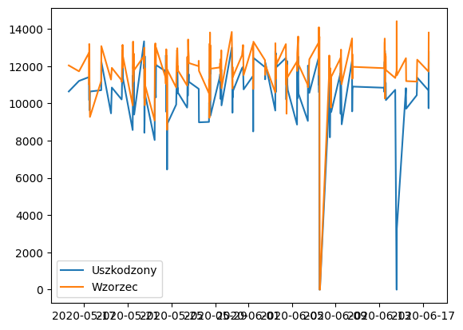

# ☀️ Solar Farm Efficiency Analysis & Anomaly Detection

## 📌 Project Overview
An analytical project focused on optimizing the performance of a solar power plant. The goal was to identify underperforming inverters among 22 units and quantify the financial impact of technical faults using statistical analysis.

## 💼 Business Impact
* **Anomaly Detection:** Identified **2 faulty inverters** that were consistently underperforming compared to the farm's median output.
* **Loss Quantification:** Calculated a potential **11.2% energy generation loss** from the affected units.
* **Actionable Insight:** Provided specific data points to prioritize maintenance schedules, moving from reactive to condition-based maintenance.

## ⚙️ Technical Approach
1.  **Data Cleaning:**
    * Filtered out night-time sensor noise (zero irradiation periods).
    * Applied domain-specific thresholds (Irradiation > 0.1) to isolate active production hours.
2.  **Statistical Analysis:**
    * Used **Median** as a robust baseline (instead of Mean) to avoid skewing by outliers.
    * Implemented **Boxplots** to visually segregate healthy vs. faulty units.

## 🛠️ Tech Stack
* **Language:** Python 3.x
* **Libraries:** Pandas (Data Wrangling), Matplotlib & Seaborn (Visualization)
* **Tools:** Jupyter Notebook

## 📊 Visual Evidence

> *Figure 1: Comparison showing the faulty inverter deviating significantly from the median performance line.*

---
*Author: [Jonas Wessling]*
*Physics Student & Aspiring Scientific Software Engineer*